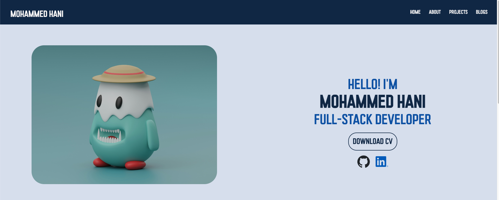
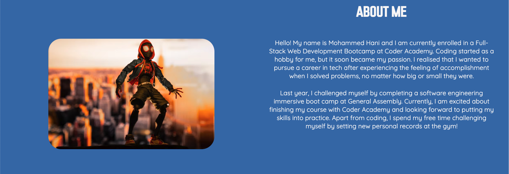
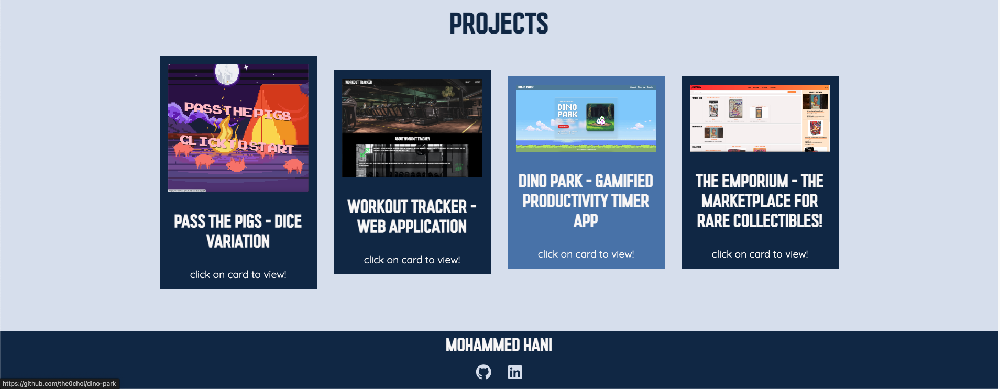
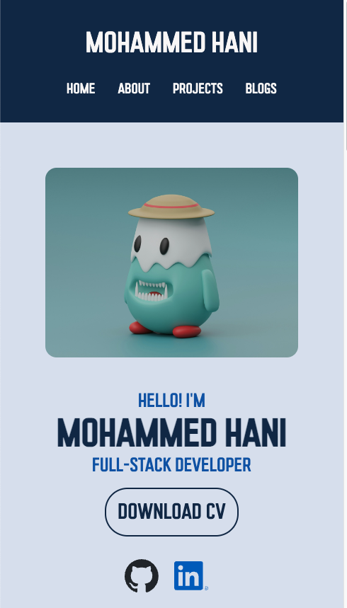
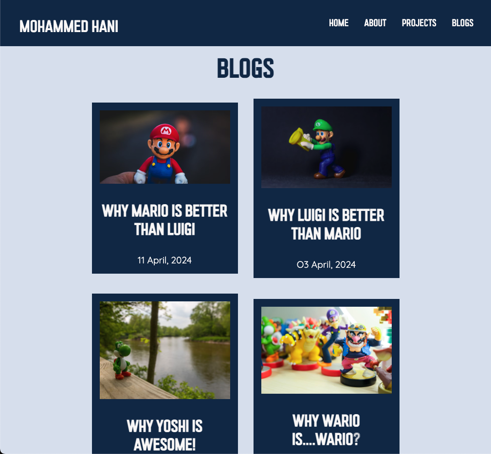
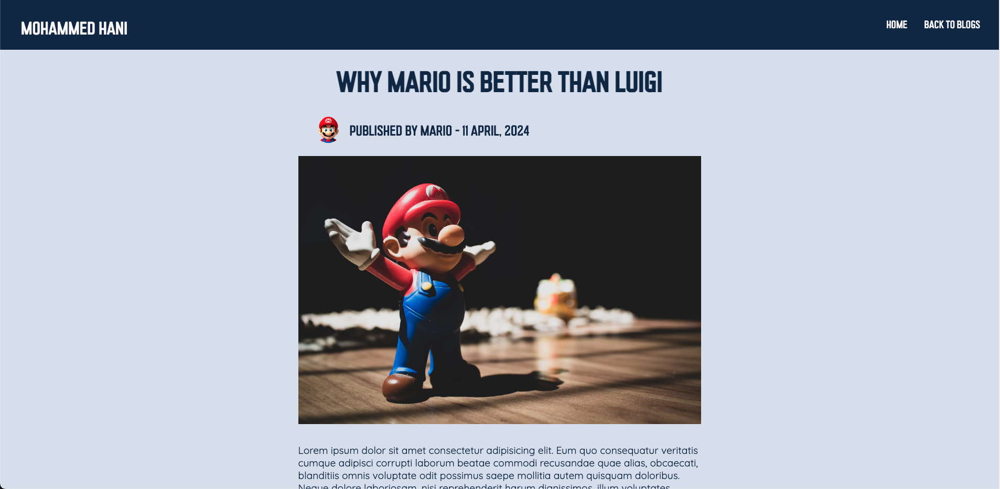

# T1A2: Portfolio

Portfolio Website Link: [Click Here!](https://motech99.github.io/T1A2_Portfolio/)

GitHub Repository Link: [Click Here!](https://github.com/motech99/T1A2_Portfolio)

## Table of Content

- [Descripton](#descripton)
- [Sitemap](#sitemap)
- [Target Audience and Website Components](#target-audience-and-website-components)
- [Tech Stack](#tech-stack)

## Descripton & purpose

Welcome to my portfolio! This project was part of my assessments during Term 1 at Coder Academy. The purpose of this project was to demonstrate my understanding of HTML and CSS by creating a fully responsive portfolio. I achieved this by testing the usage of Flexbox/CSS Grid. The project also tested my understanding of how HTML works, including being able to connect multiple HTML documents, as well as the decision process of creating a website such as wireframes and mockups of the pages. Through this project, I gained valuable hands on experience in debugging errors and improved my thought process when it came to problem solving. It also helped me improve my attention to detail.

It is important to demonstrate my understanding to my educators as well as to showcase my abilities to potential employers.

### Functionality / features

**Multiple HTML Documents:** This portfolio includes multiple HTML documents to stay consistent and also separate different sections of the pages, each connecting to different sections of the website to facilitate easy navigation for users.

**Fully Responsive Design:** This portfolio was designed to be accessible and visually appealing on different screen sizes using Mobile First Responsive Design.

**Links To Socials:** This feature makes it easy to navigate to my GitHub or LinkedIn profiles. Links are available both in the main section and footer.

**Links To Projects Repo:** This feature displays clickable cards with image previews of GitHub repositories for each project.

**Downloadable CV:** This feature allows potential employers or users to easily download and view my CV.

**Flexbox and CSS Grid:** This portfolio heavily depends on using both Flexbox and CSS Grid. Flexbox is utilised for mobile and tablet screen sizes to center different sections of the pages. It is also used to flex wrap the projects/blog cards in order to maintain responsiveness. For larger screen sizes, the main section and the about me section use Flexbox Grid to create a two-dimensional layout.

**Wireframes and Mockups** Before developing the website, a sitemap was created to outline the overall structure. Mockups were then made for mobile, tablet, and desktop screens using Uizard.

### Screenshots

placeholder

## Sitemap

### Website Structure and Navigation Overview

#### Website Structure

I have finalised a simple website structure based on the sitemap provided earlier. The Home page will serve as the central hub of the website and will have two sections, the About section and the Project section. The blog page will be separate from the Home page and will lead to individual blogs, each following the same layout.

#### Navigation Flow

**Home Page:** When users visit my website, they will be directed to the Home Page. The Home Page has a navigation bar that displays different options such as Home, About Me, Projects, and Blogs. Users can click on the Home option to return to the Home Page. The About Me option takes them to the About Me section, the Projects option navigates them to the Projects section, and the Blogs option leads them to the Blogs page. The navigation bar is designed to help the users move around the website quickly and easily.

 **Main section:** Upon entering the website, users can see a greeting message followed by my name. They can also download my CV by clicking the button provided or visit my GitHub and LinkedIn accounts through the icons displayed.

 **About Me Section:** This section provides an overview of myself. It includes my passion for coding, why I started, what I'm currently doing, what I've done before, and my hobbies.

 **Project Section:** This section displays all of my Projects as cards, each with a preview image, title and description.

**Blogs Page:** The Blogs page uses the same cards as the Project one however it displays a preview image, article title and a published date. from there, users then can navigate to each blog by clicking on the respective cards. This page also has the same navigation bar which can lead back to the Home page or About/Project section.

 **Blog 1-5 Page:** Each blog page features a navigation bar that offers the option to return to the Home page or the Blogs page. The page includes an article title, the name of the author, the date of publication, and a photo. These elements are then followed by an article section and the main content of the article.

### Decision-Making Process for overall Aesthetic

#### Mobile screen Home Page Wireframe

#### Tablet screen Home Page Wireframe

#### Desktop screen Home Page Wireframe

#### Mobile screens Blogs Page Wireframe

#### Tablet screen Blogs Page Wireframe

#### Desktop screen Blogs Page Wireframe

#### Mobile screen individual Blog Page Wireframe

#### Tablet screen individual Blog Page Wireframe

#### Desktop screen individual Blog Page Wireframe

I created wireframes using Uizard, an online design tool that I found to be more beginner-friendly than Figma. It was easy to create wireframes for different screen sizes and sections of the site, allowing me to make changes and test different colour schemes and responsiveness across all screens. For my Home page, I was inspired by one-dimensional layouts commonly used in portfolios, and I separated the page into two sections: About and Projects. I decided to place these sections on the same page as they felt they were related. For the rest of the site, I separated the Blogs into a different page, leading to individual blogs. For the blog page, my plan was inspired by Medium, an online publishing platform, which uses a similar layout to what I envisioned what I wanted my Blog page to look like.

When it came to the overall look of my portfolio, I decided to look at various portfolio layouts and colour schemes. I discovered that the choice of colours is important for creating a cohesive theme that ties all the components together. This contributes to the overall layout and helps users to easily distinguish between different sections of the page. After testing different colour schemes, I decided to go with a blue colour palette as the theme for my website. For headings and Footers, I used a dark navy blue colour, while for the body I used a lighter blue colour. The colours work well with each section, creating a simple yet effective theme, in my opinion.

## Target Audience and Website Components

### Components list

### Main Page

- **Navigation Bar :** Responsively designed navigation bar with each heading linked to the relevant section of the page, providing better accessibility on every page. This applies to every page of the website.

- **Main Section:** This is the main section of the website. It features an image with a heading, a button to download my CV, and social media icons for GitHub and LinkedIn, which lead to those profiles. This setup allows potential employers to access my CV and also enables other developers to connect with me on LinkedIn or GitHub. I chose to place these elements on my main page to ensure they are the first features visitors see when they land on my website. This should make it easier to build connections and easier to network.

- **About Section:** Features an image with a section of a paragraph about myself showing my interests, hobbies, and why I started coding. This section allows the readers to get to know me a little better and the reason why I started coding!

- **Project Section:** This section of my website showcases all of my previous projects that I have worked on. It allows users to see the type of projects I've previously worked on. It features an image of the project, a brief description, and a link to the GitHub repository for that project. Each card changes to a lighter colour when hovered over to help the users distingush between cards

- **footer:** The footer component of a website is a section that is dedicated to displaying copyright details that indicate ownership, along with social media icons that are linked to the owner's profiles. Consistency in design is crucial to maintaining a professional look on the website. Therefore, it is essential to have a footer on each page of the website to keep the layout consistent.

### Blogs Page

- **Navigation Bar:** Same as Home page.

- **Main Section:** This section of the website is accessed by clicking on "Blogs" from the navigation bar. I decided to do this so the users can mainly focus on Blogs only and nothing related to me as they are different topics. Each blog contains an image, title and the date published. each blog is separated from the others for better readability for the users. This component uses the same component as the project's card with minor adjustments to the description.

- **Footer:** Same as Home Page.

### Individual Blog Page

- **Navigation Bar:** In this component, I have decided to remove some of the navigation links to only display the Home and the Blogs links. This improves readability for the users and makes it easier to navigate between those pages.

- **Main Section:** This component is made up of the Title of the Blog, the author's image and the published date. This is then separated by the image and finally, the article will be displayed at the bottom of that section. All articles are centred in the middle of the page in all screen sizes. This technique is used by other blogs/article sites that I came across. I believe It helps with the readability of the website as it's in the center of the page.

- **Footer:** same as Home Page.

### other

Each componenet has been fully designed to be responsive on all screen sizes. for the navigation and the header bar, I added minor animations. These animations consists of changing the colour of the text and adding a lighter colour with delay when hovered over. I also changed the cursor to pointer when hovered as well as this makes it easier for the users to select which sections of the page to go to. I also applied this to the Blogs cards and the project cards with colour change and pointer to cursor. I also used some minor animations on the download button to light up when hovered over as well as cursor changing to pointer for the same reason. The social media icons i just changed the cursor to pointer again for the users to know that its clickable. I tried to keep the animations as minium as possible but just enough to help with the flow of the pages for each sections allowing the users to engage with different sections of the page.

#### Typography

When it comes to typography on a webpage, I prefer to use two different fonts. One for the main headings and another for long paragraphs of text. This approach makes the website look more professional and helps users differentiate between the two sections, enabling them to decide which text is more important. Additionally, it enhances the visual appeal of the website and improves readability as users will see the larger text first.

## Tech Stack

- HTML
- CSS
- SCSS
-Uizard
